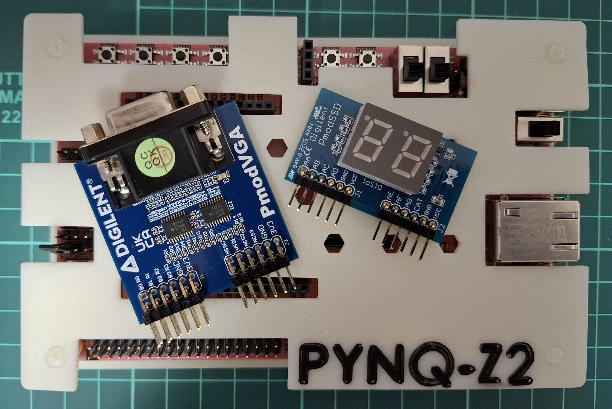

# Nandland Go Board Tutorial (PYNQ-Z2 Board)

## About

This repository contains source code from Nandland Go Board Tutorial by Russell Merrick ([link](hhttps://nandland.com/go-board-tutorials/)).

Only the Verilog parts of the tutorial are implemented.

The code in this repository is meant to be used with the PYNQ-Z2 ([link](https://www.amd.com/en/corporate/university-program/aup-boards/pynq-z2.html))

This project uses the PYNQ-Z2 switches, Digilent 7-segment Display Pmod ([link](https://digilent.com/reference/pmod/pmodssd/start)), and Digilent VGA Pmod ([link](https://digilent.com/reference/pmod/pmodvga/start))

Code is implemented using Vivado 2024.2.2



### Notes:

**The PYNQ-Z2 LAN cable must be connected for proper functionality due to clock source limitations.**

**In these design, we used Raspberry Pi Header for UART. Use a USB UART adapter and connect: GND to Pin 39 (G), RX to Pin 37 (W9), and TX to Pin 35 (Y8).**

## Contents

### Project 7: UART Part 1 - Receive Data from Computer

Send data from computer to FPGA over UART. The FPGA receives the data and displays the corresponding ASCII character code on the 7-segment display.

Use 115200 baudrate.

### Project 8: UART Part 2 - Transmit Data to Computer

Send data from computer to FPGA over UART. The FPGA receives the data and displays the corresponding ASCII character code on the 7-segment display, then send back the data to Computer.

Use 115200 baudrate.

### Project 9: VGA Introduction

Show VGA test pattern that can be selected using UART input.

Use 115200 baudrate.

### Project 10: Pong Game

Play 2 player Pong ([link](https://en.wikipedia.org/wiki/Pong)) with VGA output and button control. Game started using UART input.

Use 115200 baudrate.

# How to use Serial Terminal

## Using MobaXterm (Windows)

- Download and Install MobaXterm
- Connect to Serial port with 115200 as baudrate

## Using tio (Ubuntu)

- Install `tio`
```
snap install tio --classic
```
- Connect to Serial port with 115200 as baudrate, replace `</dev/ttyUSB1>` with correct port.
```
tio /dev/ttyUSB1 -b 115200
```
- If you get permission error add the user into dialout group, then reboot your PC
```
sudo usermod -a -G dialout <username>
```
